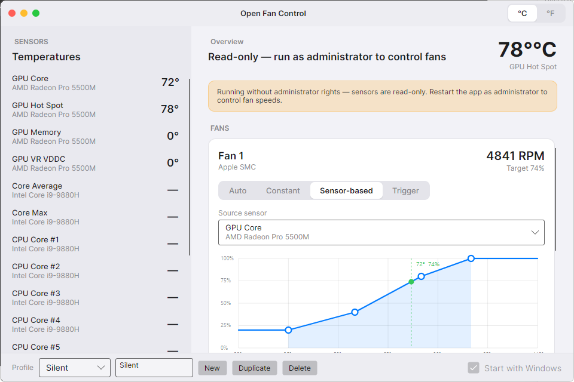

<div align="center">


# Open Fan Control

**An open-source, macOS-styled fan control & temperature monitor for Windows** — a free alternative to [Macs Fan Control](https://crystalidea.com/macs-fan-control), with real fan control on Intel Macs (including T2) *and* regular PCs.

Built with **.NET 8 + Avalonia UI** (one native runtime, no Electron) and [LibreHardwareMonitorLib](https://github.com/LibreHardwareMonitor/LibreHardwareMonitor).



</div>

## Features

- **Live monitoring** — CPU / GPU / motherboard / storage temperatures and fan RPMs.
- **Four control modes per fan:**
  - **Auto** — hand the fan back to the firmware.
  - **Constant** — hold a fixed duty %.
  - **Sensor-based** — a **multi-point graph curve** (click to add points, drag to move, right-click to remove) with a live operating marker.
  - **Trigger** — two-speed on/off with hysteresis (idle until a load temp, load until it cools back down).
- **Custom (derived) sensors** — build your own source:
  - **Mix** — combine sensors with `Max / Min / Average / Sum / Subtract` (e.g. *max of CPU + GPU*).
  - **Time Average** — smooth a sensor over a window.
- **Smooth & quiet** — per-fan **hysteresis** (no hunting on small swings) and **response time** (gradual ramps).
- **Advanced tuning** — **Min speed** floor, **Stop below** (snap to 0), **Kickstart**, and an **Avoid band** to skip a rattly RPM zone.
- **Profiles** — save multiple setups (e.g. *Silent* / *Turbo*) and switch instantly.
- **macOS-style UI** — traffic-light chrome, translucent sidebar, rounded cards, light & dark aware.
- **System tray**, **Start with Windows** (silent, elevated logon task), **single instance**, **°C / °F**, settings persisted to `%AppData%\OpenFanControl\settings.json`.

## Fan-control support matrix

| Hardware | Monitoring | Fan control | How |
|----------|:---------:|:-----------:|-----|
| Windows PCs (supported SuperIO/EC) | ✅ | ✅ | LibreHardwareMonitor (WinRing0) |
| Intel Macs **without** T2 (~2017 and earlier) | ✅ | ✅ | Apple SMC via legacy port I/O |
| Intel Macs **with** T2 (2018–2020) | ✅ | ✅¹ | Apple SMC via MMIO — see note |
| Apple Silicon (M-series) | — | — | can't run Windows natively |

> **¹ T2 Macs:** the SMC lives behind the T2 chip and is reached through MMIO, which needs a
> signed kernel driver. Open Fan Control **reuses the `applesmc.sys` driver that ships with
> [Macs Fan Control](https://crystalidea.com/macs-fan-control)** (service `AppleSMC`, device
> `\\.\APPLESMC`) — so **install Macs Fan Control once** and Open Fan Control can drive your
> T2 Mac's fans. We do **not** redistribute their proprietary EV-signed driver; we only use it
> if it's already present. If it isn't, T2 Macs fall back to monitoring only. On pre-T2 Macs and
> PCs no extra driver is needed.

## Install

### Quick install (recommended)

Open **PowerShell** and run:

```powershell
irm https://raw.githubusercontent.com/MateusRed/Open-Fan-Control/main/scripts/install.ps1 | iex
```

This downloads the latest self-contained build to `%LocalAppData%\OpenFanControl` and adds
Start-Menu & Desktop shortcuts. Launch it and accept the UAC prompt (fan control needs admin).

### Manual

Download `OpenFanControl.exe` from the [latest release](https://github.com/MateusRed/Open-Fan-Control/releases/latest)
and run it. It's a single self-contained file — no .NET install required.

## Requirements

- Windows 10 / 11 (x64).
- **Administrator at runtime** — sensor access and fan control go through kernel drivers, so the
  app requests elevation (UAC on launch). Without it you still get temperature monitoring.
- **T2 Macs only:** Macs Fan Control installed (for its `AppleSMC` driver — see the matrix note).

## Build from source

```powershell
dotnet restore
dotnet build -c Release

# run (UAC prompt appears — the app requests admin)
dotnet run --project src/OpenFanControl -c Release

# or publish a single self-contained .exe -> publish/OpenFanControl.exe
dotnet publish src/OpenFanControl -c Release -r win-x64 --self-contained `
  -p:PublishSingleFile=true -o publish
```

## How it works

- **Sensors & PC fans:** a LibreHardwareMonitor `Computer` enumerates sensors; fans exposing a
  duty-cycle control are paired with their RPM sensor.
- **Apple SMC (`Services/Smc/`):** a pluggable `ISmcTransport` speaks the applesmc command
  protocol — over legacy ports 0x300/0x304 on pre-T2 Macs, or over the `\\.\APPLESMC` kernel
  driver (MMIO) on T2 Macs. SMC access is gated behind an SMBIOS "Apple Inc." check so it never
  touches those ports on a PC.
- **Control loop:** every ~1.5 s `FanController` evaluates each fan's curve/trigger through
  hysteresis + response-time smoothing + advanced tuning, then issues the duty. On exit every fan
  is released back to firmware control so nothing gets stuck at a forced speed.

## Safety

- Setting fans too low can let components overheat — curves default to a safe ramp, and rising
  temperatures always take effect immediately.
- On quit or crash, all fans return to **Auto** (firmware) control.

## License & credits

- **MIT** — see [LICENSE](LICENSE).
- [LibreHardwareMonitorLib](https://github.com/LibreHardwareMonitor/LibreHardwareMonitor) — MPL-2.0.
- T2 fan control interoperates with the `AppleSMC` driver from CrystalIDEA's *Macs Fan Control*;
  that driver is **not** included or redistributed here.

> Not affiliated with Apple or CrystalIDEA. Use at your own risk.
